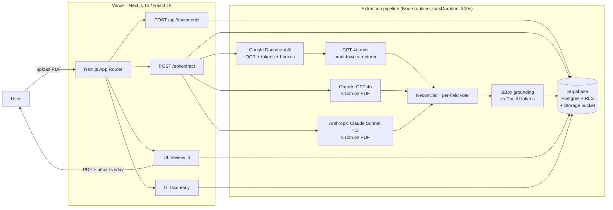
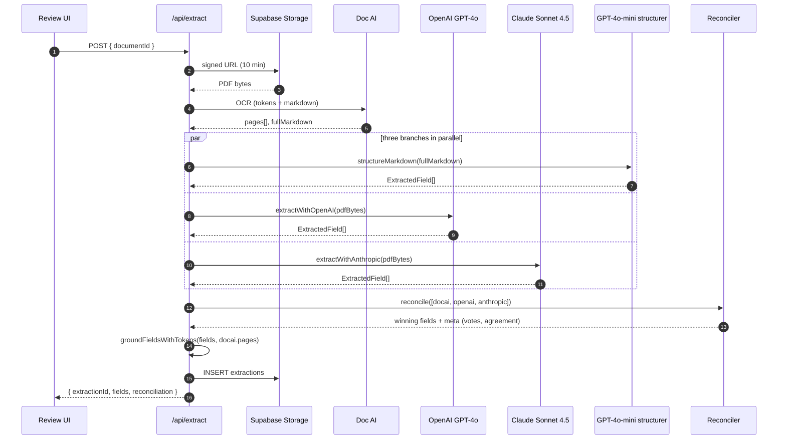
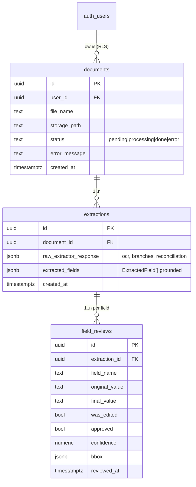
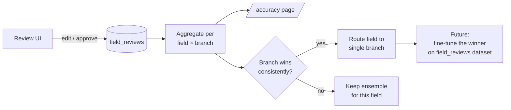

# Solum Health — Document AI MVP

> Submission for the Solum Health technical challenge.
> A web app that ingests heterogeneous clinical documents (clean PDFs, scanned faxes, handwritten notes, insurance cards, lab reports), extracts structured data with a **three-model ensemble**, auto-fills the *Service Request Form*, and lets a human review/correct each field with the source PDF anchored next to it.

**Live demo:** _add Vercel URL here_
**Walkthrough (Loom):** _add link here_

---

## TL;DR

- **Upload** any of the 6 sample documents (01–06) or your own.
- Three extractors run in parallel against the same JSON schema (Doc 07):
  - **Google Document AI** → OCR + per-token bounding boxes → **GPT-4o-mini** structurer
  - **OpenAI GPT-4o** vision over the raw PDF
  - **Anthropic Claude Sonnet 4.5** vision over the raw PDF
- A **reconciler** votes per field. 2-of-3 wins. 0-of-3 is surfaced as a *disagreement* — never hidden.
- A **bbox grounding** step anchors each winning value back to Doc AI tokens, so the review UI can highlight the exact region of the PDF on hover.
- The review UI shows confidence, edit state (was_edited), and approval state. Edits are persisted and feed an **accuracy dashboard**.

---

## How it maps to the challenge

| Challenge requirement | Where it lives |
|---|---|
| 1. Extract structured data from messy docs | `lib/docai.ts`, `lib/openai-extractor.ts`, `lib/anthropic-extractor.ts` |
| 2. Auto-fill the *Request for Approval of Services* form (Doc 07) | Schema in `lib/types.ts` (`FORM_SECTIONS`) drives prompts + UI |
| 3. Handle confidence / ambiguity | `lib/reconciler.ts` emits per-field `agreement` (`all` / `majority` / `none` / `single`); UI flags disagreements and low-confidence fields |
| 4. Track accuracy | `field_reviews` table records `was_edited` per field; `/accuracy` page aggregates correction rate by field |

---

## Architecture



Three independent extractor branches produce the **same `ExtractedField[]` shape**. Only Doc AI emits reliable per-token bounding boxes, so the reconciler picks the winning value and a later grounding step finds that value in Doc AI's tokens to anchor it visually on the PDF.

---

## Extraction pipeline in detail



### Reconciliation rules (`lib/reconciler.ts`)

- **2-of-3 agree** → that value wins, inheriting confidence and `source_quote` from a winning branch.
- **0-of-3 agree** → the value with the highest individual confidence wins, but the field is tagged `disagreement` so the UI can flag it. We prefer a *false unsure* over a *false confident*.
- **Type-aware normalization** per field:
  - `text` / `longtext`: lowercase + collapse whitespace + strip punctuation; `longtext` also falls back to Jaccard similarity over word tokens, so paraphrases count as agreement.
  - `list`: compared as sets of normalized strings.
  - `table`: rows aligned by the first column (key), then each cell voted independently.

### BBox grounding (`lib/bbox-grounding.ts`)

General-purpose vision LLMs are unreliable at coordinates. Doc AI is reliable. So we decouple **"what value is correct"** (ensemble) from **"where is it on the page"** (Doc AI tokens). After reconciliation, each winning value is searched against Doc AI's tokens (tolerant of split tokens) to synthesize the bbox that the review UI overlays on the PDF.

---

## Data model



**Row Level Security** is enforced on every table against `auth.uid()`. Storage objects follow the `userId/...` convention so a user can never read or write data they don't own — even by manipulating IDs in the client.

---

## AI tools used (and how)

The challenge brief explicitly asks for an honest breakdown. Here it is:

| Tool | Role |
|---|---|
| **Google Document AI** | Authoritative OCR — provides per-token text + bounding boxes. Single source of truth for *where* a value is on the page. |
| **OpenAI GPT-4o** (vision) | Independent extractor — reads the PDF as images, returns the schema directly. Best on clean typed and structured documents. |
| **Anthropic Claude Sonnet 4.5** (vision) | Independent extractor — same input, different model family. Useful as a tiebreaker, and in our tests it handles handwritten/messy docs (Doc 06) better than GPT-4o alone. |
| **GPT-4o-mini** | Cheap structurer — turns Doc AI's markdown into the same `ExtractedField[]` schema so the OCR branch can vote alongside the vision branches. |
| **Claude Code** | Used to build the project itself — pipeline scaffolding, schema generation from the *Service Request Form*, reconciliation logic, this README. |
| **Cursor / GitHub Copilot** | Inline edits, prompt iteration. |

The design intent is that **adding a fourth extractor (Gemini, Mistral OCR, etc.) is a 30-line change** in `/api/extract` — every branch returns `ExtractorResult`, the reconciler is provider-agnostic.

---

## Stack

| Layer | Tech | Why |
|---|---|---|
| Frontend | Next.js 16 (App Router), React 19, Tailwind 4 | Matches Solum's stack; App Router gives one project for UI + API. |
| OCR + token bboxes | Google Document AI | Reliable coordinates that visual LLMs don't provide. |
| Vision extraction | OpenAI GPT-4o + Claude Sonnet 4.5 | Two independent vendors → real ensemble diversity. |
| Auth + DB + Storage | Supabase (Postgres + RLS + private bucket) | Matches Solum's stack; RLS replaces a permissions layer. |
| PDF rendering | `react-pdf` | Client-side rendering so bbox overlays line up exactly. |
| Deploy | Vercel (Node runtime, `maxDuration = 300`) | Same target as Solum. |

I did **not** use Prisma — Supabase's typed client + raw SQL migrations were enough for an MVP and saved an ORM layer.

---

## Repo layout

```
app/
  (app)/                 # Authenticated routes
    dashboard/           # User's documents
    review/[documentId]/ # PDF + sidebar with editable fields + bbox overlay
    accuracy/            # Field-level correction rate (was_edited %)
  (auth)/                # Supabase SSR login/signup
  api/
    documents/           # Upload + list
    extract/             # Pipeline orchestration (see above)
    review/              # Persist field_reviews

lib/
  docai.ts               # Google Document AI client
  docai-structurer.ts    # Markdown → ExtractedField[] via GPT-4o-mini
  openai-extractor.ts    # GPT-4o vision over PDF
  anthropic-extractor.ts # Claude Sonnet 4.5 vision over PDF
  reconciler.ts          # Per-field voting, type-aware
  bbox-grounding.ts      # Anchor values to Doc AI tokens
  extractor-shared.ts    # Shared prompt + schema validation
  types.ts               # FORM_SECTIONS (Doc 07 schema), ExtractedField
  supabase/              # SSR + browser clients

supabase/migrations/     # Versioned schema (RLS, storage policies)
scripts/test-pipeline.ts # Run the 3-branch pipeline against a local PDF
docs/                    # RFC, mockup, sample documents (01–07)
```

---

## Running it locally

```bash
# 1. Install
npm install

# 2. Env vars (see .env.local.example)
#    SUPABASE_URL, SUPABASE_ANON_KEY, SUPABASE_SERVICE_ROLE_KEY
#    OPENAI_API_KEY
#    ANTHROPIC_API_KEY
#    GOOGLE_APPLICATION_CREDENTIALS=./gcp-service-account.json
#    DOCAI_PROCESSOR_ID, DOCAI_LOCATION
cp .env.local.example .env.local

# 3. Apply migrations
#    Paste supabase/migrations/*.sql into the Supabase SQL editor, in order.

# 4. Run
npm run dev
# → http://localhost:3000
```

To smoke-test the pipeline headlessly: `scripts/test-pipeline.ts` runs all three branches against a local PDF and prints the reconciliation table.

### Offline eval

A reproducible eval harness lives under `scripts/eval/`:

```bash
# Generate LLM ground truth once (careful Claude Sonnet 4.5 pass per sample).
# Writes scripts/eval/ground-truth/*.json — hand-review and correct afterwards.
npm run eval:generate

# Run the eval: full pipeline vs ground truth, per-field × per-branch accuracy.
# Writes a markdown report to scripts/eval/results/<iso>.md.
npm run eval
```

The report shows per-document, per-branch, and per-field accuracy, plus a final table of *where each branch wins* — which is the signal the routing / fine-tuning roadmap depends on. Ground truth is LLM-generated, so treat the numbers as comparative ("branch X loses on field Y"), not absolute. See `scripts/eval/README.md`.

---

## Key technical decisions (and trade-offs)

1. **Ensemble over single-model.** A single vision LLM on these documents hallucinates dates, member IDs, and CPT codes silently. Three independent branches turn silent errors into visible disagreements. **Cost:** 3× the per-doc API spend. **Worth it** because the human-in-the-loop signal (`disagreement`) is what makes the tool trustworthy.

2. **Disagreement as a first-class citizen.** The reconciler never tries to look confident when models conflict. The UI shows the field with the highest individual confidence but flags it — instead of pretending we know.

3. **BBox grounding decoupled from extraction.** Vision LLMs are unreliable at coordinates. Doc AI is reliable. Decoupling lets each side improve independently.

4. **Declarative schema (`FORM_SECTIONS`).** The form (Doc 07) is encoded once in `lib/types.ts` and drives prompts, reconciliation, validation, and UI. Changing a field is a single edit.

5. **RLS before app-layer auth.** Authorization lives in Postgres, not handlers. Endpoints can't forget to filter by `user_id` — the database refuses.

6. **Failure isolation with `Promise.allSettled`.** If one provider is down, extraction degrades (2 branches instead of 3) but doesn't break. The error is persisted alongside the extraction for debugging.

7. **Sync request, not a queue (MVP).** Vercel `maxDuration = 300s` is enough for the 6 sample docs. Production would replace this with a queue + SSE/WebSocket updates — see roadmap.

8. **No Prisma.** The Supabase typed client + raw SQL migrations covered everything an ORM would, with one fewer abstraction to debug.

---

## Feedback loop — from ensemble to a single trusted model

The current architecture is intentionally over-engineered for accuracy: three independent extractors per document. That's the right call **right now**, when we have no ground truth and no signal about which model is best for which kind of field. But every approval and every correction the user makes in the review UI is *labeled data* — and the schema is already capturing it:



Concretely, `field_reviews` already stores `original_value`, `final_value`, `was_edited`, and `approved` per field. Cross-referencing each row with `extractions.raw_extractor_response.branches` (which keeps each branch's individual answer) gives us **per-field, per-branch accuracy** out of the box.

The roadmap that data unlocks:

1. **Per-field routing.** Once a field shows e.g. >95% accuracy on a single branch over N documents, drop the other branches *for that field*. We pay 1× the API cost on safe fields and keep 3× only on the ambiguous ones.
2. **Confidence calibration.** Use `was_edited` as the binary label and train a small calibrator (logistic regression / gradient boost) on model-reported confidence + agreement + field type. The output is a real *probability the user will edit this field* — that's the signal the UI should show, not raw model confidence.
3. **Fine-tuning the winner.** Once a single model is the clear winner on a class of documents (clean typed notes, lab reports, handwritten…), the corrected `final_value` pairs become a fine-tuning dataset. Fine-tune the winner; retire the ensemble on that class.
4. **Active learning on disagreements.** When the three branches disagree, the corrected answer is the most valuable training signal. Prioritize those examples for any future fine-tune.
5. **Per-payer / per-form schemas.** `FORM_SECTIONS` becomes a tenant-scoped resource; each tenant's `field_reviews` informs its own routing.

The endgame is the opposite of the current diagram: a single, calibrated, possibly fine-tuned model handling 90% of fields, the ensemble reserved for the long tail where it still beats a soloist. The MVP is built so that transition is a config change, not a rewrite.

---

## What I'd improve with more time

- **Offline eval harness.** Ground-truth JSON for the 6 sample docs + metrics in CI: exact match, normalized edit distance, agreement %, per-field accuracy by branch. Today accuracy is measured *online* from user edits, which is useful but slow.
- **Streaming results to the UI.** Server-Sent Events so users see Doc AI's bboxes appear immediately while vision branches are still running.
- **Async queue** (Inngest / Upstash QStash) instead of holding a 5-minute Vercel request open.
- **Calibrated confidence.** Today confidence is model-reported + agreement heuristic. A calibrator trained on `field_reviews` would give a real probability of error per field.
- **Per-field routing.** `field_reviews` already shows which fields some branches systematically lose. Route those fields to the consistent winner instead of voting.
- **Multi-form / multi-tenant.** Today `FORM_SECTIONS` is hard-coded to Doc 07. Promote it to a per-tenant resource for other payers.
- **PHI safety.** This is a demo — no BAA in place with the AI vendors. Production would need HIPAA review and BAAs with OpenAI, Anthropic, and Google.

---

## License

Technical assessment / demo. Not for use with real PHI without proper compliance review.
