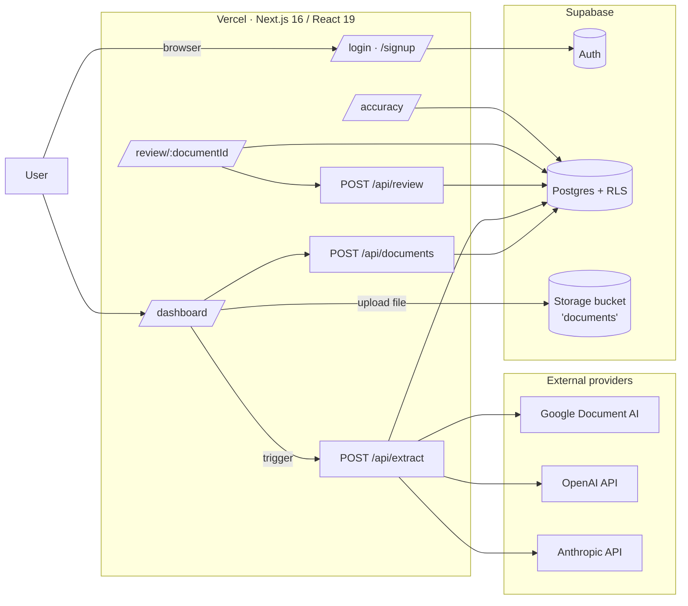
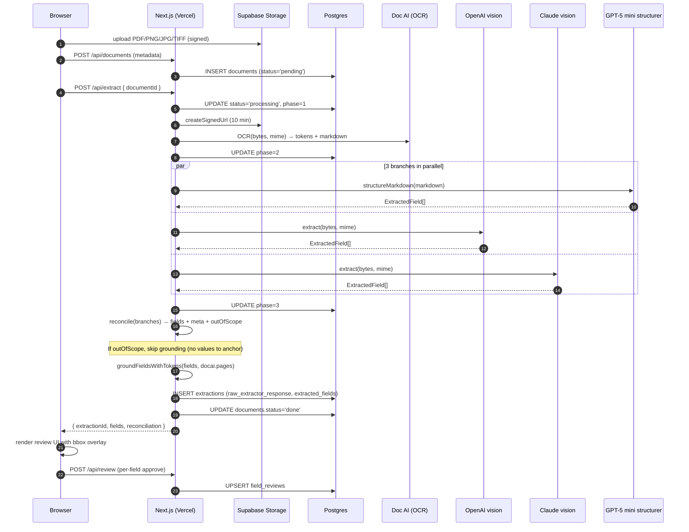
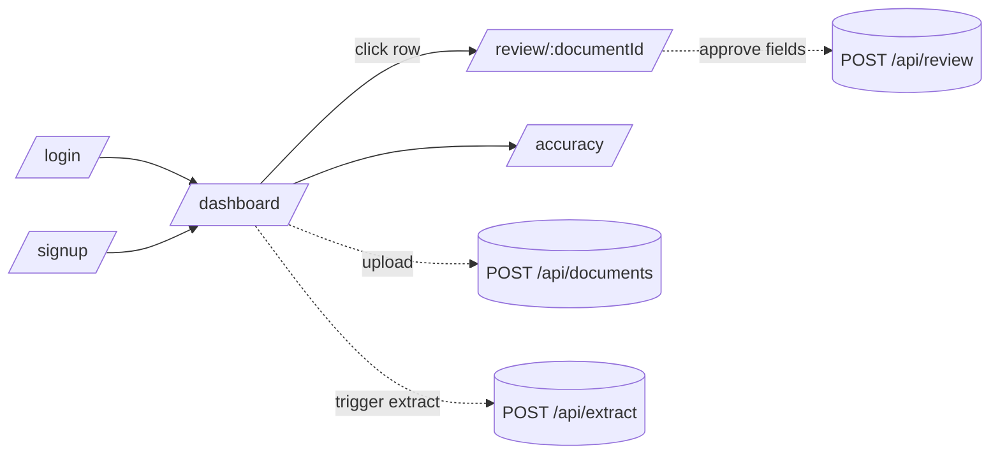

# Architecture

End-to-end view of the Solum Health Document AI system: how an uploaded file becomes a reviewed, structured form. All diagrams render natively on GitHub (Mermaid).

---

## 1. High-level system



The browser talks to Next.js routes only. All third-party calls (Document AI, OpenAI, Anthropic) are server-side — API keys never reach the client. Supabase enforces Row Level Security on every table so a user can only ever read/write their own documents.

---

## 2. Request lifecycle: upload → extract → review



Doc AI's OCR runs first because both the structurer (which reads its markdown) and the bbox grounding step (which uses its tokens) depend on it. The two vision branches run alongside the structurer, all writing to the same `ExtractedField[]` shape so the reconciler can vote without translation.

---

## 3. The 3-branch ensemble + reconciler

```mermaid
flowchart TB
    INPUT[/PDF or image\nfrom Supabase Storage/]

    subgraph Branches["3 independent branches — same JSON schema"]
        direction LR
        subgraph DocAIPath["Doc AI branch"]
            DA[Document AI\nOCR + tokens + bboxes]
            STR[GPT-5 mini structurer\nmarkdown → ExtractedField[]]
            DA --> STR
        end
        VIS1[OpenAI GPT-4o vision\nPDF/image → ExtractedField[]]
        VIS2[Claude Sonnet 4.5 vision\nPDF/image → ExtractedField[]]
    end

    INPUT --> DA
    INPUT --> VIS1
    INPUT --> VIS2

    STR --> REC[Reconciler\nper-field vote\nDoc AI is source of truth]
    VIS1 --> REC
    VIS2 --> REC

    REC --> GRD[BBox grounding\nphrase-split for longtext\npunctuation-aware tokenizer]
    DA -. tokens .-> GRD
    GRD --> OUT[/Final fields\nvalue + confidence + bboxes[] + agreement/]
```

**Why three branches?**

- **Doc AI** is the ground-truth anchor: it produces real per-token bboxes and the structurer maps those tokens to the schema. Cheapest per call.
- **OpenAI vision** sees the raw file — captures layout cues (checkboxes, table alignment) that the markdown loses.
- **Claude vision** is the strongest narrative reasoner; valuable on handwritten / SOAP notes where the past/present/future split needs interpretation.

### Out-of-scope detection (embedded classifier)

Before voting on field values, the reconciler votes on **whether the document belongs in the pipeline at all**. The classification is not a separate model call — it is part of each branch's existing prompt. Every branch returns a top-level boolean alongside the schema fields, in the same response:

```jsonc
// In-scope response (clinical doc)
{ "is_medical_document": true,
  "fields": { "member.last_name": { "value": "Dominguez", ... }, ... } }

// Out-of-scope response (pizza menu, receipt, contract, etc.)
{ "is_medical_document": false,
  "out_of_scope_reason": "This is a restaurant menu.",
  "fields": {} }
```

**Voting rule.** The document is declared out of scope when:

```
noVotes.length > 0  AND  noVotes.length >= yesVotes.length
```

— i.e. a majority of *the branches that voted* says "not medical", with at least one explicit "no". Branches that error or omit the flag don't count (they abstain). When the verdict triggers:

- `extracted_fields` is forced to all-nulls.
- The bbox grounding step is skipped (nothing to anchor).
- `raw_extractor_response.out_of_scope` is persisted with each branch's vote + the one-line reason.
- The review page replaces the form panel with an amber "Out of scope" banner that shows the reason and a link back to the dashboard.

**Why embedded, not a separate upfront classifier.** A dedicated upfront call (e.g. Haiku with a 1-token yes/no answer) was considered. The embedded approach was chosen because:

| Dimension | Embedded (current) | Upfront separate classifier |
|---|---|---|
| Cost / latency on the **common case** (real clinical doc) | None — the classification rides on a call we already make | +1 round-trip and +1 model call per doc |
| Cost / latency on **out-of-scope case** | All 3 branches still ran to vote, then returned empty | Could short-circuit and skip the 3 expensive branches |
| Robustness to a misclassification | 3 independent votes; tolerant of one branch being overly strict | Single point of failure — wrong → silent extraction kill |

When production sees a high rate of non-clinical uploads, the next optimization is the upfront short-circuit (cheap, fast) **in addition to** the embedded check — the embedded vote stays as the ground truth, and the upfront classifier is just an early exit. Until then, the embedded design pays no extra cost on the happy path.

Test fixture: `files/edge-cases/E01-pizza-menu.pdf`. All 3 branches vote `is_medical_document=false`, reconciler returns 0 fields, UI shows the banner.

### Reconciler rules (`lib/reconciler.ts`)

| Situation | Resolution |
|---|---|
| **All 3 agree** (after type-aware normalization) | That value, agreement=`all`. |
| **2 agree** (cluster) | That value. Doc AI is preferred winner if it's in the cluster; otherwise highest individual confidence. agreement=`majority`. |
| **Only 1 branch has a value, it's Doc AI** | Use it. agreement=`single`, winner=`docai`. |
| **Only 1 branch has a value, it's OpenAI or Claude** | **Suppress the value** (return null). Meta still records the proposal so the UI shows a soft "Suggested" hint that the reviewer can manually accept. Prevents lone hallucinations from being persisted. |
| **All 3 disagree, Doc AI has a value** | Use Doc AI. agreement=`none`. UI shows ⚠ "Models disagree". |
| **All 3 disagree, Doc AI is null** | Return null. We have no grounded signal, and picking by LLM-reported confidence risks accepting a hallucination. |

**Type-aware normalization** (used to decide whether two values "agree"):

- `text` / `longtext`: lowercase, strip punctuation, collapse whitespace; `longtext` also accepts Jaccard ≥ 0.6 over word tokens (paraphrase tolerance).
- `list`: compared as sets of normalized strings.
- `table`: rows aligned by the first column (key column), then cells voted independently within aligned rows.

### Prompt design (`lib/extractor-shared.ts`)

All three branches receive **identical instructions** — diversity should come from the model, not from prompt drift. The shared `SYSTEM_PROMPT_BASE` enforces:

- **Semantic mapping over literal labels.** "ID#" in a handwritten note still belongs to `member.member_id` even though the label isn't "Member ID".
- **Temporal separation** for the three clinical narratives. Sentences are partitioned by tense — current state → `presenting_symptoms`; prior treatments/response → `clinical.history`; forward plan → `treatment_goals`. No copy-pasting across fields.
- **Assessment scores = today's measurement only.** When a doc says "PHQ-9: 14 (was 21 on 1/15)", the current row is 14/today; the 21/1/15 belongs in `clinical.history`.
- **Never fabricate.** Anchor every value to text present in the document.

---

## 4. BBox grounding (`lib/bbox-grounding.ts`)

The vision branches do not produce reliable per-token bounding boxes. Doc AI does. So we decouple **"what is the right value"** (ensemble) from **"where is it on the page"** (Doc AI tokens) — after reconciliation, every winning value is re-anchored to Doc AI's token stream.

```mermaid
flowchart LR
    V[Reconciled field\nvalue + source_quote] --> T{Field type?}
    T -->|text| W1[Truncate to 6 words\nmatch single contiguous run\nin Doc AI tokens]
    T -->|list| W2[Match each item\nseparately]
    T -->|table| W3[Match first non-empty\ncell of each row]
    T -->|longtext| W4[Prefer source_quote\nfall back to value\nsplit into phrases\nmatch each]
    W1 --> OUT[bbox + bboxes[]]
    W2 --> OUT
    W3 --> OUT
    W4 --> OUT
```

The matcher tries **two tokenizations of the value** in priority order:

1. **Punctuation-aware split** (`ANT-XK7829014` → `["ANT", "XK7829014"]`) — handles IDs Doc AI fragmented on hyphens.
2. **Whitespace-only split** (`"2/5/26"` stays one token) — handles composite tokens Doc AI kept whole.

Whichever produces a contiguous run first wins. For longtext, `source_quote` (the model's verbatim citation) is preferred over `value` (which may be a paraphrase) — when the doc says "starting Lexapro 10mg 3 wks ago" but the model writes "Started Lexapro 10mg 3 weeks ago", the source_quote still grounds.

Output: every field carries `bbox` (the union rectangle) plus `bboxes: BBox[]` (one box per matched phrase). The PDF viewer renders all boxes simultaneously on hover.

---

## 5. Database schema

```mermaid
erDiagram
    "auth.users" ||--o{ documents : owns
    documents ||--o{ extractions : "0..n versions"
    extractions ||--o{ field_reviews : "1 per reviewed field"

    documents {
        uuid id PK
        uuid user_id FK
        text file_name
        text storage_path
        text status "pending | processing | done | error"
        smallint phase "0..3 — sub-step within processing (1 OCR, 2 ensemble, 3 reconcile)"
        text error_message
        timestamptz created_at
    }
    extractions {
        uuid id PK
        uuid document_id FK
        jsonb raw_extractor_response "ocr, pages, markdown,\nbranches.{docai|openai|anthropic},\nreconciliation, out_of_scope"
        jsonb extracted_fields "ExtractedField[] grounded"
        timestamptz created_at
    }
    field_reviews {
        uuid id PK
        uuid extraction_id FK
        text field_name
        text original_value
        text final_value
        bool was_edited
        bool approved
        numeric confidence
        jsonb bbox
        timestamptz reviewed_at
        unique extraction_id,field_name
    }
```

- **`documents`** — one row per uploaded file. Status machine drives the dashboard polling.
- **`extractions`** — one row per pipeline run. New extraction inserts append (we keep history); the review page reads the most recent. The `raw_extractor_response` jsonb holds everything the ensemble produced (raw branch outputs + reconciliation meta) so we can re-run analytics or train router models later without re-extracting.
- **`field_reviews`** — one row per (extraction, field) the reviewer touched. `was_edited` captures whether the human changed the AI's value; the `/accuracy` page aggregates this into per-field correction rate, which is the feedback signal a routing/fine-tuning loop would need.

**Row Level Security** on every table — users can only see their own documents (and extractions/reviews via the FK chain). Storage paths follow `userId/...` so even direct-URL access is bounded by ownership.

**Migrations** are append-only in `supabase/migrations/`:

- `0001_init.sql` — bootstrap tables + RLS policies + storage bucket.
- `0002_rename_extractor_response.sql` — renamed `raw_mistral_response` → `raw_extractor_response` when the pipeline moved off single-OCR to the 3-branch ensemble.
- `0003_documents_phase.sql` — added `phase smallint` to `documents` so the dashboard can show sub-step progress while a doc is `processing`. Phases: `1` OCR, `2` ensemble extraction, `3` reconcile + bbox grounding + persist. Once the third phase finishes the row flips to `status='done'` (no `phase=4` — "done" is a terminal status, not a fourth working phase). Bumped from `app/api/extract/route.ts` after each milestone; the dashboard renders a 3-wedge ring (`PhaseRing` in `document-list.tsx`) with a soft pulse on the active wedge and a `fill` CSS transition so the next wedge fades in smoothly when the polling tick advances the phase.

---

## 6. Supported file formats

| Type | MIME | Handled by |
|---|---|---|
| PDF | `application/pdf` | Doc AI (rawDocument), OpenAI (`type: file`), Anthropic (`type: document`) |
| PNG | `image/png` | Doc AI, OpenAI (`type: image_url`), Anthropic (`type: image`) |
| JPEG | `image/jpeg` | same |
| WebP | `image/webp` | same |
| GIF | `image/gif` | same |
| BMP | `image/bmp` | Doc AI, OpenAI |
| TIFF | `image/tiff` | Doc AI (best for multi-page faxes) |

`lib/mime.ts` derives the MIME from the file extension and the same byte buffer flows to all three branches with the right content-type. The review UI ramifies between `react-pdf` (PDFs) and an `` + canvas loupe (images), sharing the same bbox overlay component.

---

## 7. Frontend routes



| Route | Server / Client | Purpose |
|---|---|---|
| `/login`, `/signup` | Server | Supabase Auth UI. |
| `/dashboard` | Server (RSC) + client island | Lists docs by status, "Upload" + "Run sample batch" actions. Polls every 2.5s while any doc is processing; the status cell renders a 3-wedge ring (`0/3 → 3/3`) driven by `documents.phase`, with the active wedge softly pulsing. The 3-state ring is replaced by a green `DONE` badge once `status='done'`. |
| `/review/:documentId` | Server (loads data) + heavy client | Side-by-side PDF / image viewer + Service Request Form. Section-paginated form with chip nav, per-section approve, multi-bbox highlights on hover, loupe, zoom. |
| `/accuracy` | Server | Per-field accuracy rollup across all the user's reviewed extractions. |

The review page is the most complex client surface. Key components:

- `pdf-viewer.tsx` — PDF (react-pdf) or single image. Owns zoom, loupe, BBox overlay, scroll-to-highlight.
- `field-card.tsx` — One per schema field. Hosts the editor (text / longtext autogrow / list / table), the approve button, and the `ReconciliationBadge` chip (⚠ Models disagree | · Suggested) with a selectable-votes popover that lets the reviewer pick any branch's proposal.
- `review-client.tsx` — Orchestrates state: current section, hovered field, approved set, bulk approve in parallel.

---

## 8. File layout

```
app/
├── (app)/                    auth-gated app shell
│   ├── dashboard/            list + upload + sample batch
│   ├── review/[documentId]/  PDF + form + bbox overlay
│   └── accuracy/             per-field correction rate
├── api/
│   ├── documents/            list / get
│   ├── extract/              the 3-branch pipeline
│   └── review/               approve/edit a single field
├── login/, signup/           Supabase auth
└── layout.tsx                global app shell

lib/
├── docai.ts                  Doc AI OCR client (PDF + image)
├── docai-structurer.ts       GPT-5 mini · markdown → ExtractedField[]
├── openai-extractor.ts       GPT-4o vision branch
├── anthropic-extractor.ts    Claude Sonnet 4.5 vision branch
├── extractor-shared.ts       Shared system prompt + JSON parsing
├── reconciler.ts             Per-field vote + agreement metadata
├── bbox-grounding.ts         Value → Doc AI token bbox(es)
├── mime.ts                   File extension → MIME
├── types.ts                  Schema (FORM_SECTIONS) + runtime types
├── field-reviews.ts          Value (de)serialization for field_reviews
└── supabase/                 SSR + browser Supabase clients

scripts/
├── test-pipeline.ts          Offline smoke test (no DB writes)
├── inspect-latest.ts         Dump latest extraction per-branch
├── bbox-audit.ts             Bbox coverage report across docs
├── check-assessments.ts      Per-branch field debug
└── eval/                     Ground truth corpus + accuracy harness
    ├── ground-truth/         Hand-curatable JSON labels (5 docs)
    └── results/              Timestamped markdown reports

supabase/migrations/          0001 init, 0002 column rename
files/                        02-06 sample inputs (07 = target form)
docs/                         this file + loom script + design notes
```

---

## 9. Trust boundaries and where keys live

- **Browser**: only Supabase anon key (RLS protects everything).
- **Vercel server**: holds the privileged keys — `SUPABASE_SERVICE_ROLE_KEY`, `OPENAI_API_KEY`, `ANTHROPIC_API_KEY`, `GOOGLE_APPLICATION_CREDENTIALS`, `DOCAI_PROJECT_ID/LOCATION/PROCESSOR_ID`.
- **DB**: no secrets, but PHI-shaped data — every table is RLS-locked by `user_id`.
- **Storage**: signed URLs only (10 min for extract, 30 min for review). Direct bucket access blocked.

External providers see the document bytes; nothing identifies the end user.

---

## 10. Observable signals the system emits (for future feedback loops)

The DB already stores enough to drive a routing or fine-tuning loop without further instrumentation:

- `raw_extractor_response.branches.*.fields[].value` — each branch's raw output per field.
- `raw_extractor_response.reconciliation[]` — which branch won each field and the agreement level.
- `field_reviews.was_edited` — did the human override the model? Per field.
- `field_reviews.final_value` vs `extracted_fields[].value` — the ground-truth signal.

Aggregated, these answer: *which branch is systematically best at which field, and what's the per-field correction rate over time?* That's the feedback the README's "Feedback loop" section turns into a routing strategy.
